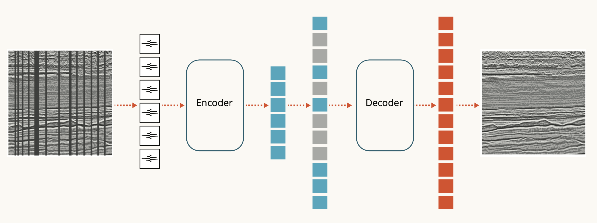

# Model Card for ThinkOnward's Geophysical Foundation Model

This model has been pushed to the Hub using the [PytorchModelHubMixin](https://huggingface.co/docs/huggingface_hub/package_reference/mixins#huggingface_hub.PyTorchModelHubMixin) integration:

This is a model based on [Meta's ViTMAE model](https://huggingface.co/facebook/vit-mae-base), with some modifications to the masking technique. The Geophyiscal Foundation Model, or GFM for short, uses the ViT architecture with masking on traces in 2D seismic images, rather than patches.

## Model Details

### Model Description

ThinkOnward's Geophysical Foundation Model is a pre-trained a Vision Transformer pre-trained on 450 synthetically generated Synthoseis 3D seismic volumes. We use a new elastic architecture and trace masking process to fine-tune the Geophysical Foundation Model for the downstream task 
of seismic interpolation. We use 50 3D seismic volumes from the Patch the Planet Challenge, hosted by ThinkOnward as our benchmark hold-out dataset. **Using a Structural Similarity Index Metric (SSIM) to 
compare results we document the Geophysical Foundation Model is 2-3 times better than Shang et al. (2023), and similar to Lasscock et al. (2024).**

- **Developed by:** Ognjen Tanovic and Mike McIntire of ThinkOnward (Shell Portfolio Company)
- **Model type:** MAE
- **License:** Apache 2.0
- **Based on:** facebook/vit-mae-base

### Model Sources

Link to the model repository listed below. This model was also presented as a poster at the AAPG/SEG IMAGE Conference in Houston, Texas August 26th-29th, 2024.

- **Repository:** https://github.com/thinkonward
- **Conference Poster Abstract:** https://imageevent.aapg.org/portals/26/abstracts/2024/4092088.pdf

## Uses

### Direct Use

This model is a modified version the [ViT MAE](https://huggingface.co/docs/transformers/en/model_doc/vit_mae) architecture. The model was used to pretrain a backbone using 450 synthetically generated seismic volumes. The goal of this project is to demonstrate that Vision Transformers (ViT) with Masked Autoencoders (MAE) can be used to leverage large amounts of unlabeled seismic data through masking to train an encoder to recognize specfic features in seismic data. The pretrained backbone can then be used with a specific downstream task like interpolation, denoising, and segmentation.

### Downstream Use

Downstream tasks include:

    Regression:
        - Interpolation of missing sections of seismic images
        - Denoising seismic data
        - Inversion (planned)
    Classification:
        - Segmentation of horizons
        - Segmentation of faults (in progress)
        - Segmentation of geobodies (in progress)

### Out-of-Scope Use

The backbone of this model was trained using 3D seismic data from the Patch the Planet Challenge hosted by ThinkOnward. Use of this model on anything outside of seismic data, or similar technologies would be out-of-scope and likely have poor performance.

## How to Get Started with the Model

You can load the model using:

```python
import torch
from huggingface_hub import hf_hub_download

# For root directory
model_path = hf_hub_download("thinkonward/geophysical-foundation-model", "elasticvitmae.bin")

ElasticVitMAE = torch.load(model_path)
```

Once the mode architecture has been defined, you can use `.from_pretrained()` to extract weights!

```python
model = ElasticViTMAE.from_pretrained("thinkonward/geophysical-foundation-model")
```

## Training Details

### Training Data

The data used to train the Geophysical Foundation Model was 450 synthetically generated seismic volumes. The data was generated using the [Synthoseis package](https://github.com/sede-open/synthoseis), which is a synthetic seismic data generator. The data was generated using the default rock properties model in the code repository. The data was genereated for the [Patch the Planet Challenge](https://thinkonward.com/app/c/challenges/patch-the-planet), hosted by ThinkOnward.

**Training Dataset Card:** [patch-the-planet](https://huggingface.co/datasets/thinkonward/patch-the-planet)

## Evaluation

#### Testing Data

Test data was generated using the same Synthoseis package as the training data. The test data was generated using the same rock properties model as the training data. The test data was generated for the [Patch the Planet Challenge](https://thinkonward.com/app/c/challenges/patch-the-planet), hosted by ThinkOnward.

**Benchmark Dataset Card:** [patch-the-planet-benchmark](https://huggingface.co/datasets/thinkonward/patch-the-planet-benchmark)

#### Metrics

**Structural Similarity Index (SSIM)** - The primary metric for comparison of interpolation results is the `scikit-image` implementation of the [Structural Similarity Index](https://scikit-image.org/docs/stable/auto_examples/transform/plot_ssim.html). The Structural Similarity Index is a metric used to measure the similarity between two images. When the SSI equals 1, the images are identical. When the SSI equals 0, the images are completely dissimilar. Please refer to the `scikit-image` docs for more information about the metric, as well as examples of implementation. Similarity will be calculated for all predictions. The minimum and maximum SSI values will be dropped, and the mean SSI score across all predictions will be the final score. 

**Mean Squared Error (MSE):** - The Mean Squared Error is a metric used as a loss metric for this model to measure the average of the squares of the errors between the true and predicted values. The lower the MSE, the better the model is at predicting the values. MSE is used for regression tasks.

**Cross Entropy Loss:** - The Cross Entropy Loss is a metric was used as a loss metric for this model to measure the average of the loss function for all predictions. The lower the Cross Entropy Loss, the better the model is at predicting the values. Cross Entropy Loss is used for downstream classification and segmentation tasks.

### Results

We use 50 3D seismic volumes from the Patch the Planet Challenge, hosted by ThinkOnward as our benchmark hold-out dataset. Using a Structural Similarity Index Metric (SSIM) to 
compare results we document the Geophysical Foundation Model is 2-3 times better than Shang et al. (2023), and similar to Lasscock et al. (2024).


### Model Architecture and Objective



This model uses a modified version of the ViT MAE architecture. The model uses a masking technique on traces in 2D seismic images, rather than patches

## Citations

This model was released in conjunction with the presentation of a poster at the 2024 IMAGE Conference in Houston, Texas (August 26-29th, 2024)

**APA:**

McIntire, M., Tanovic, O., Mazura, J., Suurmeyer, N., & Pisel, J. (n.d.). Geophysical Foundation Model: Improving results with trace masking. In https://imageevent.aapg.org/portals/26/abstracts/2024/4092088.pdf. 2024 IMAGE Conference, Houston, United States of America.

**BibTex:**

@misc {thinkonward_2024,
	author       = { {ThinkOnward} },
	title        = { geophysical-foundation-model (Revision 2f8d6ce) },
	year         = 2024,
	url          = { https://huggingface.co/thinkonward/geophysical-foundation-model },
	doi          = { 10.57967/hf/2908 },
	publisher    = { Hugging Face }
}

## Model Card Contact

Please contact `challenges@thinkonward.com` for questions, comments, or concerns about this model.
